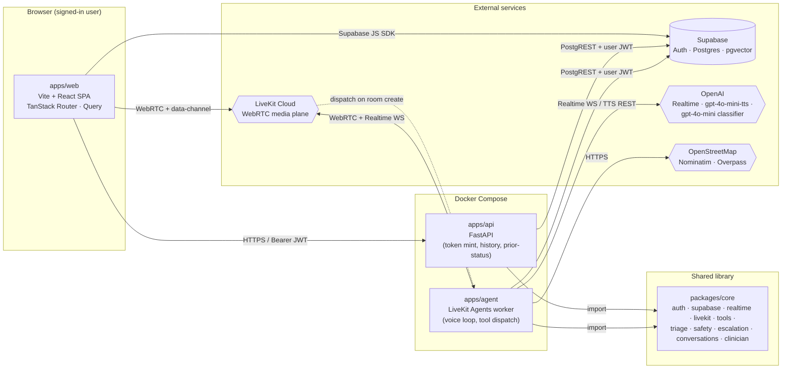
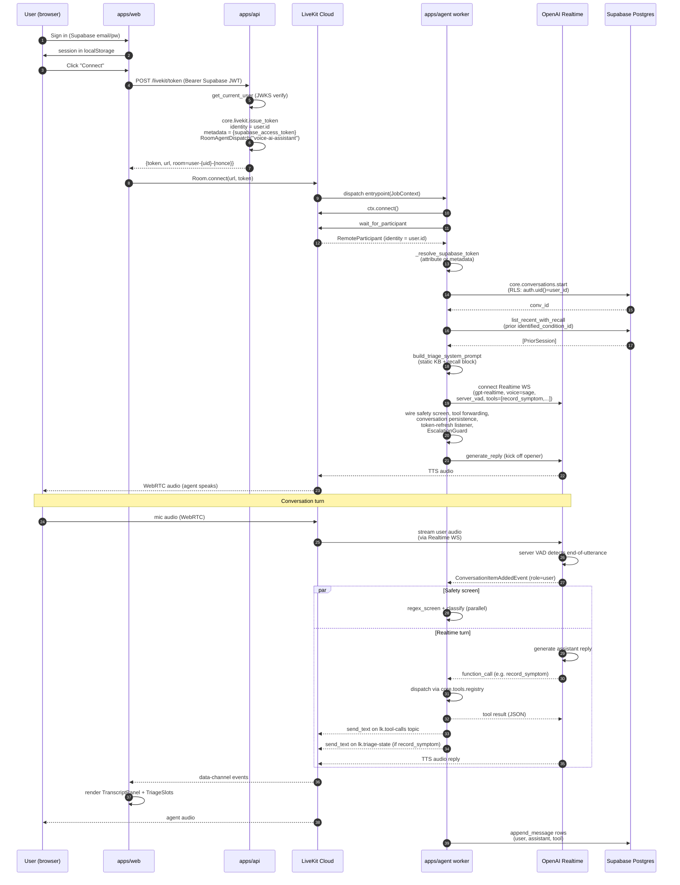
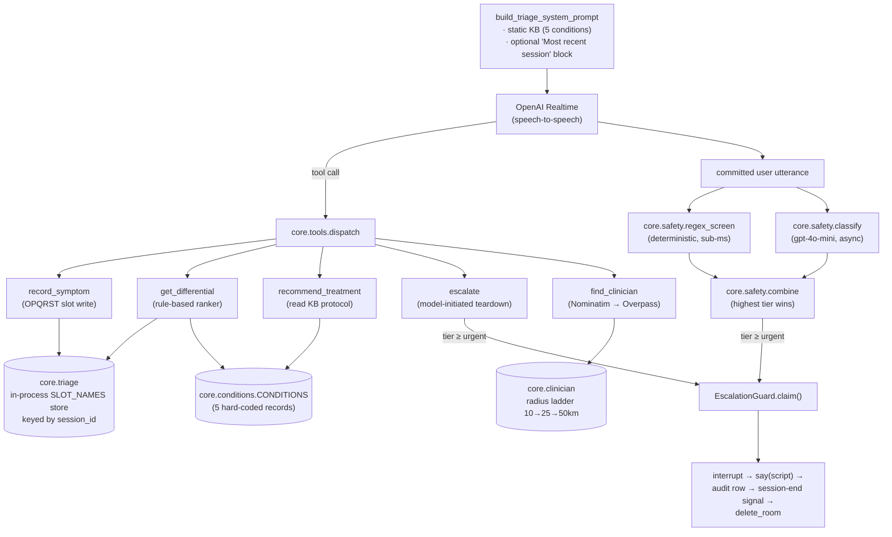
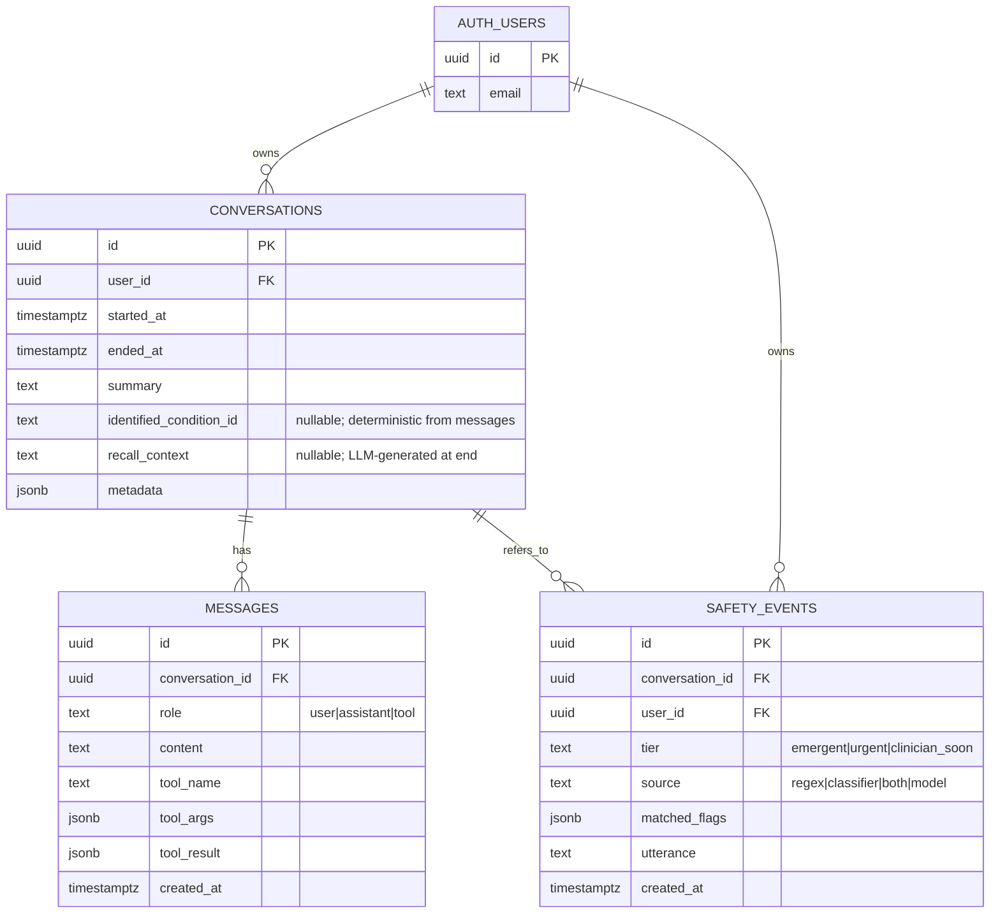
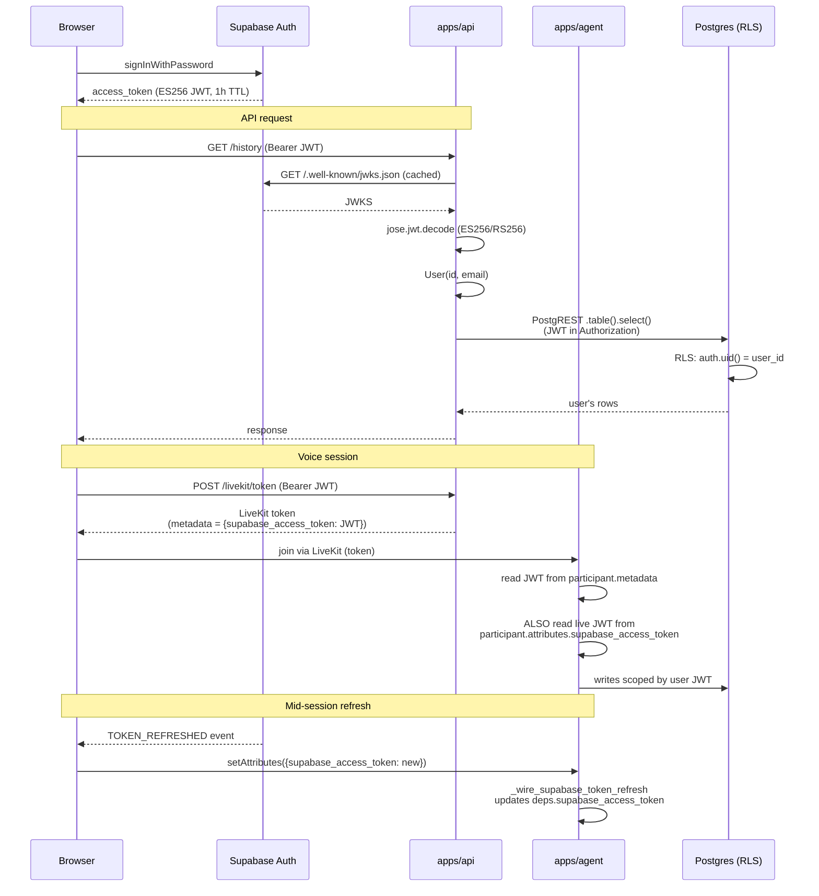
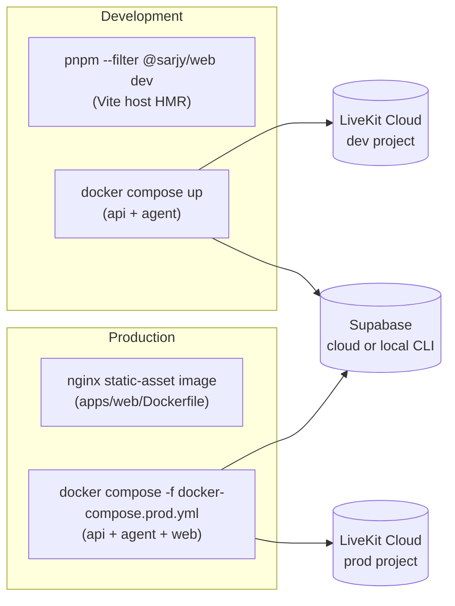

# Sarjy — Architecture

This document describes the runtime architecture of the Sarjy office-strain
triage assistant: a voice-first product built on LiveKit + OpenAI Realtime,
backed by FastAPI and Supabase. It is meant to be read alongside the ADRs
under [`docs/adr/`](./adr/) — the ADRs justify the choices below; this
document describes how the choices fit together.

---

## 1. System topology

The runtime has four processes plus three external services. Three of the four
processes are first-party (`web`, `api`, `agent`); one is the Supabase
Postgres + Auth instance, treated as infrastructure.



Key boundaries:

- **`apps/web`** is a Vite + React SPA. It signs the user in with Supabase,
  asks `apps/api` for a LiveKit access token, joins a LiveKit room, and
  renders the live transcript / OPQRST slot panel from data-channel topics
  emitted by the agent worker.
- **`apps/api`** is a thin FastAPI adapter. It mints LiveKit tokens, exposes
  conversation history, and reports prior-session status to the talk page.
  **It contains no business logic** — every route is a translation from HTTP
  to a `core` call.
- **`apps/agent`** is a long-running LiveKit Agents worker. It receives a
  dispatch when a participant joins a room, builds an `AgentSession` wired to
  OpenAI Realtime, registers triage tools, runs the OPQRST interview, and
  tears the room down on safety escalation or end-of-conversation.
- **`packages/core`** is a Python library imported by both `apps/api` and
  `apps/agent` (see ADR 0002). It owns the schema, validation, JWT
  verification, tool registry, triage state, safety screen, and the
  Supabase / LiveKit / OpenAI client factories.

External services:

- **Supabase** provides Auth (asymmetric ES256 JWTs via JWKS — see ADR 0005)
  and Postgres with the `pgvector` extension (see ADR 0003). Per-user
  isolation is enforced at the database via Row-Level Security; the
  application never filters by `user_id` in code.
- **LiveKit Cloud** is the WebRTC media plane (see ADR 0001). Signalling +
  RTP traverse LiveKit; the agent worker connects to the same room as the
  user and dispatches automatically when a token requests
  `RoomAgentDispatch(agent_name="voice-ai-assistant")`.
- **OpenAI** provides the realtime model (`gpt-realtime`, speech-to-speech),
  a separate TTS (`gpt-4o-mini-tts`) used only for the safety-script
  playback (see ADR 0007), and `gpt-4o-mini` for the classifier half of the
  red-flag screen.
- **OpenStreetMap** (Nominatim for geocoding, Overpass for healthcare-amenity
  queries) backs the `find_clinician` tool.

---

## 2. Voice-loop sequence

The end-to-end flow from "user clicks Connect" to "agent speaks the opener"
is the central interaction. Three things have to be true for a turn to land:
the user's Supabase JWT must be embedded in (and refreshed onto) the LiveKit
participant so RLS writes succeed; the LiveKit token must request the named
agent so dispatch fires; and the agent worker must wire the safety screen
_before_ `session.start` so the first user utterance is screened.



A few of those steps are non-obvious and worth pinning down:

- **Why a fresh nonce on every room name** (`user-{uid}-{nonce}`).
  livekit-agents 1.x dispatches on room _creation_, not on every join.
  Reusing a stable per-user room name leaves the second session running
  without an agent (`apps/api/api/routes.py:124`).
- **How the agent gets the user's Supabase JWT.** Two channels: the LiveKit
  token's `metadata` claim (legacy, captured at connect time) and the
  participant attribute `supabase_access_token` (live, mutable, updated by
  the frontend on every Supabase `TOKEN_REFRESHED` event). The agent picks
  the attribute first; it has to, because the Supabase JWT TTL is 1h and
  voice sessions can outlast it (`apps/agent/agent/session.py:739`).
- **Why the safety screen is wired _before_ `session.start`.** The screen
  subscribes to `conversation_item_added`. Wiring it after `session.start`
  has already run lets the first finalised user utterance fire while no
  listener is attached.
- **Why both the model and the server can teardown.** The realtime model
  can call `escalate(tier=...)` when it judges escalation is warranted. The
  regex+classifier pipeline runs independently and fires on the same turn.
  An `EscalationGuard` (one per session) makes teardown at-most-once: the
  losing path bails with a `guard_taken` log line. See ADR 0007.

---

## 3. Data plane: data-channel topics

The agent worker publishes three application-level topics to the LiveKit
data channel. The frontend's hooks subscribe to one each:

| Topic              | Producer                     | Consumer (web)                                   | Payload                                              |
| ------------------ | ---------------------------- | ------------------------------------------------ | ---------------------------------------------------- |
| `lk.transcription` | livekit-agents (built-in)    | `useLivekitTranscript` (`livekit-transcript.ts`) | `{role, text, ...}` per finalised utterance          |
| `lk.tool-calls`    | `_wire_tool_call_forwarding` | `useLivekitTranscript` (same hook)               | `{id, name, args, result, error}` per call           |
| `lk.triage-state`  | `_emit_triage_state`         | `useLivekitTriageState`                          | `{slots: {location, onset, ...}, session_id}`        |
| `lk.session-end`   | `_emit_session_end_signal`   | `useSessionEndSignal`                            | `{reason: "escalation", tier: "emergent"\|"urgent"}` |

A topic per concern means the frontend never has to parse free-form text —
the slot panel reads structured slots, the transcript reads tool calls as a
third message type, and the end-of-conversation card reacts to a single
discrete signal rather than inferring closure from connection state.

---

## 4. Triage product layer

Sarjy is not a generic assistant — the `apps/agent` worker is hard-wired to
the office-strain triage flow. The product layer lives mostly in
`packages/core`:



Three structural choices show up across this diagram:

- **OPQRST state lives in-process, keyed by session id.** It is rederivable
  from the persisted transcript if ever needed offline; storing it in the
  database would bypass `messages` without buying anything
  (`packages/core/core/triage.py:1`).
- **The safety screen is _not_ a tool the model can choose to call.** Making
  the detector model-callable was the failure mode the architecture was
  built to prevent (`packages/core/core/safety.py:1`). The `escalate` tool
  exists _in addition_, so the model can volunteer an escalation when it
  sees a red flag, but the parallel server-side pipeline does not depend on
  it.
- **The Teardown box is owned by `core.escalation.EscalationCoordinator`.**
  The two paths converge on the same coordinator instance, which holds the
  shared `EscalationGuard`, runs the persist + signal + delete sequence in
  order, and (on the classifier path only) handles the speak-script step
  via an injected TTS adapter. The classifier path's tail reads
  "interrupt → say → audit → signal → delete"; the model path's tail
  reads "wait_for_playout → audit → signal → delete" because the model
  has already spoken its own version of the script. See §7 for the full
  sequence.

The 5-condition catalogue (`carpal_tunnel`, `computer_vision_syndrome`,
`tension_type_headache`, `upper_trapezius_strain`, `lumbar_strain`) is
embedded into the system prompt at session start via `kb_for_prompt()`
(`packages/core/core/conditions.py`). The seam to switch to retrieval is the
catalogue boundary itself, but in-prompt embedding is the documented choice
until the catalogue grows past ~10 records.

---

## 5. Persistence and RLS

Every user-scoped table follows the canonical Supabase RLS pattern
established in `0002_conversations.sql`:



RLS predicates (paraphrased):

- `conversations`, `safety_events`: `auth.uid() = user_id` on the row
  being checked. CRUD policies are split per operation so a downstream
  maintainer can tweak one without rewriting the others (e.g.
  `safety_events` deliberately has no UPDATE/DELETE policies — the
  audit log is append-only).
- `messages`: no `user_id` column; policy joins through `conversations`
  on the `conversation_id` FK to enforce ownership.

The legacy `0001_user_preferences.sql` and `0003_mem0_memories.sql`
migrations are still in the migration directory for historical reasons,
but no Sarjy runtime code reads or writes those tables.

The application reaches Postgres through `core.supabase.get_user_client(jwt)`,
which constructs a per-request PostgREST client whose `Authorization` header
carries the user's Supabase JWT. PostgREST inspects the header to set the
session role and `auth.uid()`, so RLS policies apply automatically — no
`WHERE user_id = ?` in the application code.

---

## 6. Auth flow

The application uses Supabase's asymmetric JWT signing (ES256 by default,
RS256 accepted) — see ADR 0005. There is no shared HS256 secret.



Two pragmatic notes from the ADRs / GOTCHAS:

- **JWKS caching with single-retry on `kid` miss.** A token signed with a
  rotated key triggers one transparent JWKS refresh before failing
  (`packages/core/core/auth.py:75`).
- **The Supabase JWT travels through LiveKit metadata.** This is acceptable
  because the same client (the user's browser) already holds the JWT in
  `localStorage` — embedding it in the LiveKit token does not widen exposure.
  Downstream apps with shared/spectator participants should route the JWT
  through a server-side relay instead (see `core/livekit.py` docstring).

---

## 7. Escalation flow (safety floor)

Escalation is the most safety-critical path in the system. Two independent
paths can fire — a server-side regex + classifier pipeline and a
model-callable `escalate` tool — and both must converge on a single
deterministic teardown. ADR 0007 covers this in detail; the diagram below
captures the contract.

```mermaid
sequenceDiagram
    autonumber
    participant U as User
    participant OAI as OpenAI Realtime
    participant AG as Agent worker
    participant TTS as gpt-4o-mini-tts
    participant LK as LiveKit
    participant DB as Postgres

    U->>OAI: utterance ("crushing chest pain")

    par Server safety screen
        OAI-->>AG: ConversationItemAddedEvent (role=user)
        AG->>AG: regex_screen ⏃ classify (asyncio.gather)
        AG->>AG: combine → tier=emergent (regex hit)
        AG->>AG: sleep 0.3s grace
        AG->>AG: EscalationGuard.claim()
    and Model-initiated path
        OAI-->>AG: function_call escalate(tier=emergent, reason=...)
        AG->>AG: EscalationGuard.claim()
    end

    Note over AG: Only one .claim() returns True;<br/>the loser logs guard_taken and bails

    AG->>DB: safety_events.record (best-effort)
    AG->>OAI: session.llm.update_options(turn_detection=None)
    AG->>OAI: session.interrupt() (cancel in-flight reply)
    AG->>TTS: session.say(script, allow_interruptions=False)
    TTS-->>LK: scripted audio (verbatim)
    LK-->>U: "Please call your local emergency number now..."
    AG->>AG: wait_for_playout
    AG->>AG: sleep 0.5s drain
    AG-->>LK: send_text on lk.session-end<br/>{reason:"escalation", tier:"emergent"}
    AG->>LK: api.room.delete_room (server-side teardown)
    LK-->>U: WebRTC disconnect
```

Why the script flows through a separate TTS rather than the realtime model:
the realtime model is speech-to-speech — there is no separate TTS pipeline,
so `session.say()` raises _unless_ a TTS is attached. The earlier fallback
(`session.generate_reply(instructions=script)`) raced with the in-flight
auto-reply and let the model paraphrase the script. ADR 0007 records the
decision to attach `gpt-4o-mini-tts` at session construction; both the
realtime voice and the TTS voice are pinned to the overlapping catalogue
(default `sage`).

The state machine itself lives in `core.escalation.EscalationCoordinator`
(`packages/core/core/escalation.py`) — the agent worker's
`_wire_safety_screen` and `_wire_model_escalate_teardown` are
LiveKit-specific adapters that translate `conversation_item_added` /
`function_tools_executed` events into coordinator method calls and
inject the TTS / data-channel / room-delete capabilities as awaitable
callbacks. The coordinator owns the guard claim, persist, drain, and
teardown ordering; the wire functions own the LiveKit I/O. This is the
seam the unit suite at `packages/core/tests/unit/test_escalation.py`
exercises without standing up an `AgentSession`.

---

## 8. Tool registry

The tool registry is the single seam through which the realtime model calls
into application code. It lives at `packages/core/core/tools/registry.py`
and exposes three primitives:

- `@tool` — decorator that captures a function's name, the first paragraph
  of its docstring, and a JSON schema derived from its type-hinted params.
- `all_tools()` — list of `ToolSchema` for the registered handlers.
- `dispatch(name, args, ctx)` — invoke by name, wrap exceptions as
  `{"error": str}` so the model gets a structured failure to verbalise.

The agent worker doesn't call `dispatch` directly. It constructs a LiveKit
`function_tool` per registered tool name (`_make_livekit_tool`) that
delegates to `dispatch` with a per-session `ToolContext`. The context
carries the authenticated `User`, a structlog logger pre-bound with
`tool_name`, the LiveKit room name as `session_id`, and the live
Supabase JWT.

The triage product hard-codes the allowed tool set
(`TRIAGE_TOOL_NAMES = (record_symptom, get_differential,
recommend_treatment, escalate, find_clinician)`) and filters
`find_clinician` out at runtime when `OSM_CONTACT_EMAIL` is unset — the
system prompt's clinician-finding section is also gated on the same flag,
so the model is never told to call a tool that isn't registered.

---

## 9. Deployment



- LiveKit is **never** in the compose stack — both dev and prod dial a
  hosted LiveKit Cloud project via `LIVEKIT_URL`. A fork that wants to
  self-host can swap the URL and add `livekit/livekit-server` as a service
  without touching application code (ADR 0001).
- The web app runs **outside** dev compose so Vite HMR works directly
  against the host. Production bundles the SPA and serves it from nginx.
- All cross-cutting commands run through Turborepo (`pnpm dev`, `pnpm
build`, `pnpm test`, `pnpm typecheck`). Python deps are managed by
  `uv`; Node deps by `pnpm` workspaces.

---

## 10. Where to look in the code

| Concern                             | Path                                                                   |
| ----------------------------------- | ---------------------------------------------------------------------- |
| LiveKit token issuance              | `packages/core/core/livekit.py`                                        |
| Realtime model + safety TTS         | `packages/core/core/realtime.py`                                       |
| Agent entrypoint + wiring           | `apps/agent/agent/session.py:entrypoint`                               |
| Tool registry + dispatch            | `packages/core/core/tools/registry.py`                                 |
| Triage tools                        | `packages/core/core/tools/triage.py`                                   |
| OPQRST slot store + ranker          | `packages/core/core/triage.py`                                         |
| Condition knowledge base            | `packages/core/core/conditions.py`                                     |
| Red-flag screen                     | `packages/core/core/safety.py`                                         |
| Escalation state machine            | `packages/core/core/escalation.py`                                     |
| Escalation audit                    | `packages/core/core/safety_events.py`                                  |
| Conversation persistence            | `packages/core/core/conversations.py`                                  |
| Clinician finder (OSM)              | `packages/core/core/clinician.py`                                      |
| Supabase JWT verification           | `packages/core/core/auth.py`, `core/jwks.py`                           |
| Per-user PostgREST client           | `packages/core/core/supabase.py`                                       |
| HTTP routes                         | `apps/api/api/routes.py`                                               |
| Web talk page (voice console)       | `apps/web/src/components/talk-page.tsx`                                |
| Voice-session orchestration hooks   | `apps/web/src/lib/use-{voice-session,voice-state,session-snapshot}.ts` |
| Data-channel registration primitive | `apps/web/src/lib/livekit-data-channel.ts`                             |
| Data-channel topic hooks            | `apps/web/src/lib/livekit-{transcript,triage-state,session-end}.ts`    |
| RLS migrations                      | `supabase/migrations/0002_conversations.sql` … `0006_…`                |
| ADR archive                         | `docs/adr/`                                                            |
